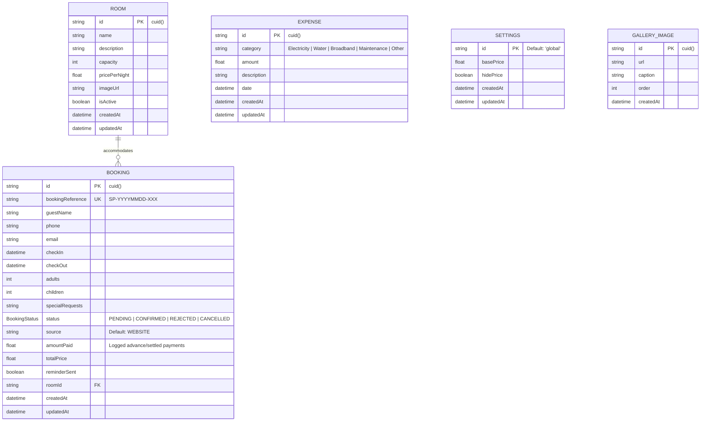
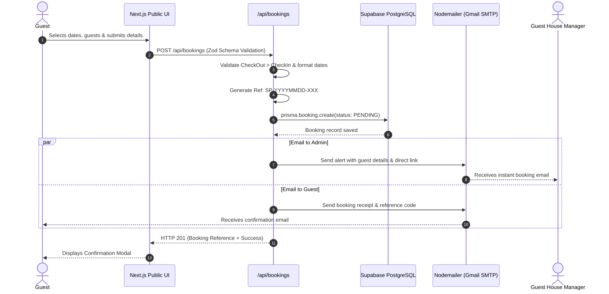

# Supipi Guest House — Complete System Architecture & Technical Documentation

> **Property**: Supipi Guest House, Haputalegama, Haputale, Uva Province, Sri Lanka  
> **Repository**: `Supipi_Guest_House`  
> **Tech Ecosystem**: Next.js 16 (App Router), React 19, TypeScript, PostgreSQL (Supabase), Prisma ORM, Tailwind CSS v4, NextAuth.js, Nodemailer

---

## 1. Executive Project Overview

**Supipi Guest House** is an all-in-one hospitality web application developed specifically for a boutique guest house nestled in the misty hill country of Haputale, Sri Lanka. The project satisfies two core objectives:

1. **Guest-Facing Experience (Public Portal)**:
   - Modern, high-conversion, responsive web experience showcasing rooms, nature experiences, property amenities, customer reviews, and local attractions.
   - Real-time availability inspection calendar.
   - Zero-friction reservation request system generating verifiable reference codes (`SP-YYYYMMDD-XXX`).
   - Automated multi-recipient transactional email notifications for guests and staff.

2. **Operations & Hospitality ERP (Admin Management Portal)**:
   - Secret, obfuscated admin routing path (`/123@supipiadmin-re`) shielded against unauthorized discovery.
   - Reservation management: Confirm, reject, cancel, or modify bookings.
   - Guest ledger: Customer history, contact details, and special requests.
   - Financial management: Income collection logging, operating expenses tracking (Electricity, Water, WiFi, Maintenance), and monthly profit & loss analytics.
   - Property CMS: Dynamic gallery management backed by Supabase cloud storage and global rate configuration.
   - Automated Cron engine: Dispatches 48-hour pre-arrival reminders with Google Maps directions.

---

## 2. Full Technology Stack Breakdown

| Layer | Technology | Version | Role & Strategic Purpose |
| :--- | :--- | :--- | :--- |
| **Framework** | **Next.js (App Router)** | `16.3.4` | Server Components (RSC) for lightning-fast SSR, route handlers for RESTful APIs, optimized asset delivery. |
| **Frontend UI** | **React** | `19.2.8` | Modern declarative UI engine with concurrent rendering. |
| **Language** | **TypeScript** | `5.x` | Strict end-to-end type safety across database entities, API payloads, and UI components. |
| **Styling** | **Tailwind CSS** | `^4.0` | Ultra-fast CSS utility engine with custom hill-country color tokens (`forest`, `sage`, `cream`, `muted-gold`). |
| **Animations** | **Framer Motion** | `^13.1` | Scroll-triggered reveals, smooth modal dialogues, and fluid state changes. |
| **Database** | **PostgreSQL (Supabase)** | Cloud | High-reliability ACID-compliant relational SQL database hosted in AWS `ap-southeast-1` (Singapore). |
| **ORM** | **Prisma ORM** | `^5.22` | Type-safe schema definition, automated migrations, connection pooling, and intuitive query builder. |
| **Authentication**| **NextAuth.js** | `^4.24` | Encrypted JWT cookie sessions with credential-based admin verification. |
| **Email Delivery**| **Nodemailer** | `^7.0` | High-deliverability SMTP integration with Google Mail App Passwords and responsive HTML templates. |
| **Asset Storage**| **Supabase Storage** | Cloud | S3-compatible cloud object bucket for high-res guest house photography and gallery uploads. |
| **Charts** | **Recharts** | `^3.10` | Interactive SVG-based charts displaying financial income vs expense distributions. |
| **Validation** | **Zod** | `^4.5` | Runtime request body schema validation and sanitization. |
| **Date Handling**| **date-fns & react-day-picker** | `^4.4 / ^10.0`| Calendar date range calculations, overlapping stay validation, and UI date picker. |

---

## 3. How the Database Works (Prisma & Supabase Deep-Dive)

### 3.1 Dual-Connection Architecture (PGBouncer + Direct)

Serverless platforms like Vercel spin up stateless serverless lambdas on demand. If dozens of requests arrive simultaneously, standard PostgreSQL connection limits can be exhausted. Supipi Guest House resolves this via a dual-connection configuration in [prisma/schema.prisma](file:///f:/Projects/Supipi_Guest_House/supipi-guest-house/prisma/schema.prisma):

```prisma
datasource db {
  provider  = "postgresql"
  url       = env("DATABASE_URL")   // Port 6543 (PgBouncer Transaction Mode)
  directUrl = env("DIRECT_URL")     // Port 5432 (Session Mode for migrations)
}
```

1. **`DATABASE_URL` (Port 6543)**: Routes runtime API queries through Supabase's transaction pooler (PgBouncer). Each database query borrows a connection only for the millisecond duration of the query, preventing connection pool exhaustion.
2. **`DIRECT_URL` (Port 5432)**: Connects directly to the PostgreSQL engine. This is required by `npx prisma db push` and `npx prisma migrate dev` because schema DDL migrations require session locks not supported by transaction poolers.

---

### 3.2 Data Models & Relational Schema



#### Detailed Model Explanations:

1. **`Room`**:
   - Represents physical room inventory (e.g., Deluxe Double Room, Family Valley View Suite).
   - Connects as a 1-to-many relationship with `Booking`.
   - `isActive` allows administrators to temporarily take a room offline for renovations without deleting historical records.

2. **`Booking`**:
   - The operational core of the platform.
   - `bookingReference`: Unique human-readable code generated at creation (e.g., `SP-20260909-412`).
   - `status`: Managed via Enum (`PENDING`, `CONFIRMED`, `REJECTED`, `CANCELLED`).
   - `amountPaid`: Accumulated cash/transfer payments logged by the administrator.
   - `reminderSent`: Boolean flag preventing duplicate 48-hour reminder emails from the automated cron job.

3. **`Expense`**:
   - Operational overhead accounting ledger.
   - Tracks operational cost categories: `Electricity`, `Water`, `Broadband`, `Maintenance`, `Food/Supplies`, `Other`.
   - Directly feeds the Financial Analytics dashboard to compute Net Revenue (`Gross Income from Bookings - Total Expenses`).

4. **`Settings`**:
   - Singleton record with `id = "global"`.
   - Controls site-wide rate display policies (e.g., `hidePrice: true` switches public CTA to "Contact for Pricing & Seasonal Offers").

5. **`GalleryImage`**:
   - Dynamic photo gallery records linked to cloud CDN URLs on Supabase Storage.
   - Ordered numerically (`order: 0, 1, 2...`) for drag-and-drop or sequential display.

---

## 4. End-to-End System Workflow

### 4.1 Guest Booking & Notification Pipeline



---

### 4.2 Automated Cron Pre-Arrival Reminder Engine

1. Every morning, Vercel Cron or an external scheduled trigger hits:
   `GET /api/cron/reminders?token={CRON_SECRET}`
2. The endpoint verifies the Bearer authorization header or secret query token.
3. The server computes the date range for **48 hours ahead** (`today + 2 days`).
4. Prisma queries all bookings where:
   - `status == "CONFIRMED"`
   - `reminderSent == false`
   - `checkIn` falls between the 48-hour window.
5. For each qualifying guest, Nodemailer delivers an email featuring:
   - Check-in time (After 2:00 PM) & Check-out time (Before 11:00 AM)
   - Property address: `Supipi Guest House, Haputalegama, Haputale`
   - Direct Google Maps satellite navigation link
   - Manager WhatsApp hotline: `+94 71 449 4314`
6. Once sent, Prisma immediately marks `reminderSent: true` on the booking record.

---

### 4.3 Security & Admin Route Obfuscation Architecture

Standard `/admin` paths are frequently targeted by automated vulnerability scanners and credential stuffing bots. Supipi Guest House uses multi-layered route protection:

1. **Obfuscated Administrative Route**:
   - Administrative portal URL: `/123@supipiadmin-re`
   - Configured in [next.config.ts](file:///f:/Projects/Supipi_Guest_House/supipi-guest-house/next.config.ts) via Next.js internal rewrites:
     - Public requests to `/123@supipiadmin-re` rewrite internally to `/admin`.
     - Direct browser attempts to navigate to `/admin` or `/admin/*` are immediately redirected back to the public homepage `/`.
2. **Server-Side Session Guard**:
   - Each admin route checks authentication at the server level via `getServerSession(authOptions)`:
     ```typescript
     const session = await getServerSession(authOptions);
     if (!session) redirect("/123@supipiadmin-re/login");
     ```
3. **Session Cookies**:
   - Encrypted JWT cookies with 30-day max-age (`strategy: "jwt"`).

---

## 5. API Reference Index

| Endpoint | Method | Authentication | Function |
| :--- | :--- | :--- | :--- |
| `/api/bookings` | `POST` | Public | Validates guest input, creates booking record, dispatches admin & guest notification emails. |
| `/api/bookings/availability` | `GET` | Public | Returns check-in/out ranges of active bookings for interactive calendar blocking. |
| `/api/cron/reminders` | `GET` | Bearer Token / Secret | Automated check-in reminder dispatcher for guests arriving in 48 hours. |
| `/api/admin/bookings` | `GET/PATCH/DELETE` | Admin Session | Manage booking records, change statuses (`CONFIRMED`, `CANCELLED`). |
| `/api/admin/bookings/payment` | `POST` | Admin Session | Incrementally log advance deposits and settled payments onto a booking. |
| `/api/admin/expenses` | `GET/POST/DELETE` | Admin Session | Record operational expenses across utility categories. |
| `/api/admin/gallery` | `GET/POST/DELETE` | Admin Session | Upload photo URLs, update captions, or remove gallery assets. |
| `/api/admin/settings` | `GET/PATCH` | Admin Session | Update base price per night or toggle price visibility site-wide. |
| `/api/auth/[...nextauth]` | `POST/GET` | Public / NextAuth | Admin login authentication handler. |

---

## 6. Directory Structure & Key Files

```text
Supipi_Guest_House/
├── readme.md                           # Root admin credential notes
└── supipi-guest-house/
    ├── .env                            # Environment variables (Database, Auth, SMTP, Supabase)
    ├── next.config.ts                  # Route rewrites (/123@supipiadmin-re) & remote image domains
    ├── package.json                    # NPM dependencies & scripts
    ├── prisma/
    │   └── schema.prisma               # Prisma data schema & models (Room, Booking, Expense, Settings)
    ├── public/                         # Static assets, branding, and local photos
    └── src/
        ├── app/
        │   ├── (public)/               # Public guest pages
        │   │   ├── page.tsx            # Main Landing Page (Hero, Rooms, Reviews, Map, CTA)
        │   │   ├── booking/            # Interactive Booking Calendar & Form
        │   │   ├── rooms/              # Detailed Room Breakdown & Amenities
        │   │   ├── gallery/            # Cloud-synced Photo Gallery
        │   │   ├── facilities/         # Amenities (WiFi, Hot Water, Mountain View, Parking)
        │   │   ├── location/           # Haputale Attractions, Travel Directions & Google Maps
        │   │   └── contact/            # Direct Contact & Inquiry Form
        │   ├── admin/                  # Protected Management Portal
        │   │   ├── page.tsx            # Operations Dashboard (Key Metrics & Bookings Table)
        │   │   ├── finance/            # Financial Analytics, Expense Logging & P&L Charts
        │   │   ├── gallery/            # Media Manager (Supabase Storage upload)
        │   │   ├── guests/             # Guest Directory & Contact Lookup
        │   │   ├── settings/           # Property Settings & Global Rates
        │   │   └── login/              # Admin Login View
        │   ├── api/                    # Serverless API endpoints
        │   ├── globals.css             # Tailwind CSS custom themes & animations
        │   ├── layout.tsx              # Root HTML Layout with metadata & analytics
        │   ├── sitemap.ts              # Dynamic SEO sitemap generator
        │   └── robots.ts               # Search engine crawler policies
        ├── components/                 # Reusable UI component modules
        │   ├── admin/                  # Admin tables, finance charts, modal forms
        │   ├── booking/                # Calendar date picker, checkout steps
        │   ├── home/                   # Hero banner, feature grids, reviews
        │   └── ui/                     # Buttons, modals, badges, inputs
        ├── config/
        │   └── business.ts             # Central property data (Phone, Address, GPS, Socials)
        └── lib/
            ├── auth.ts                 # NextAuth configuration
            ├── email.ts                # Nodemailer transporter & HTML email sender
            ├── prisma.ts               # Prisma singleton client instance
            ├── supabase-admin.ts       # Supabase client for storage and bucket operations
            └── utils.ts                # Tailwind merge and classname helpers
```

---

## 7. High-Impact Project Enhancement Ideas

To transform Supipi Guest House into an industry-leading hotel management platform, consider these recommended upgrades:

### 1. Direct Payment Gateway Integration (Online Card Payments)
- **Local Sri Lanka**: Integrate **PayHere** or **WEBXPAY** to accept LKR payments via Visa, Mastercard, Genie, eZ Cash, and FriMi.
- **International Guests**: Integrate **Stripe Checkout** for multi-currency credit card payments (USD, EUR, GBP, AUD) with instant booking confirmation.

### 2. Multi-Language Localization (i18n)
- Haputale attracts a high volume of European tourists (French, German, Dutch) alongside local Sri Lankan travelers.
- Implement Next.js App Router localization for **English**, **German**, **French**, and **Sinhala**.

### 3. WhatsApp Business Automation
- Connect the **Meta Cloud API** or **Twilio for WhatsApp**.
- Send automated instant booking confirmations, location pins, and check-in instructions directly to the guest's WhatsApp.

### 4. Dynamic PDF Invoicing & Booking Vouchers
- Use `@react-pdf/renderer` or `jspdf` to automatically generate downloadable branded booking confirmation vouchers and payment receipts with QR codes for arrival check-in.

### 5. Verified Guest Review Submission System
- After check-out, the system automatically emails guests a one-time feedback link (`/review?ref=SP-2026...`).
- Approved reviews publish instantly to the homepage with a "Verified Guest" badge.

### 6. Channel Manager Synchronization (iCal)
- Export and import standard **iCal (`.ics`) calendars** to automatically sync bookings with **Booking.com**, **Airbnb**, and **Agoda**, preventing double bookings across platforms.

---

## 8. Deployment & Environment Setup Guide

### Local Development:
```bash
# 1. Install dependencies
npm install

# 2. Generate Prisma Client
npx prisma generate

# 3. Synchronize database schema with Supabase
npx prisma db push

# 4. Start local development server
npm run dev
```

### Production Deployment (Vercel):
1. Connect repository to **Vercel**.
2. Add all environment variables from `.env` (`DATABASE_URL`, `DIRECT_URL`, `NEXTAUTH_SECRET`, `NEXTAUTH_URL`, `ADMIN_PASSWORD`, `ADMIN_EMAIL`, `EMAIL_USER`, `EMAIL_APP_PASSWORD`, `NEXT_PUBLIC_SUPABASE_URL`, `SUPABASE_SERVICE_ROLE_KEY`).
3. Set build command: `prisma generate && next build`.
4. Add Cron Job in `vercel.json`:
   ```json
   {
     "crons": [
       {
         "path": "/api/cron/reminders",
         "schedule": "0 3 * * *"
       }
     ]
   }
   ```
